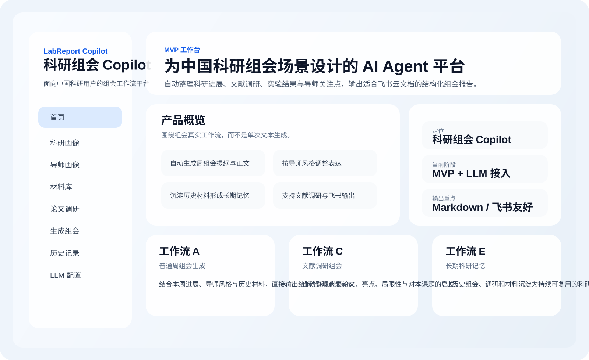
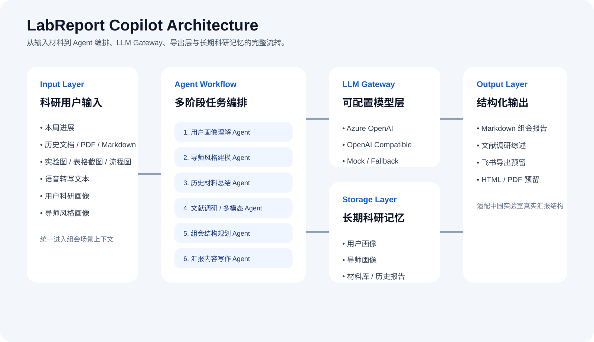
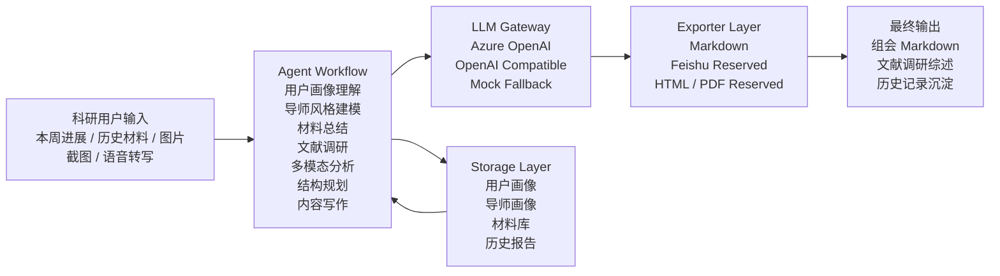

# LabReport Copilot

[](https://nextjs.org/)
[](https://fastapi.tiangolo.com/)
[](https://www.typescriptlang.org/)
[](https://www.python.org/)
[](#llm-%E9%85%8D%E7%BD%AE)
[](#%E5%BD%93%E5%89%8D%E5%B7%B2%E5%AE%9E%E7%8E%B0)
[](#%E5%BC%80%E6%BA%90%E5%8D%8F%E8%AE%AE)

> AI Copilot for research group meetings in Chinese labs.  
> 面向中国科研组会场景的多 Agent 工作流平台，自动整理科研进展、文献调研、实验图表与导师关注点，输出可直接用于飞书云文档的结构化组会汇报。



## 最新版本亮点

当前版本除了保留 MVP 能力外，已经把前端工作台做了一轮整体升级：

- 首页从功能罗列升级为工作台总览，能直接看到产品价值、核心工作流和推荐使用路径
- 公共布局重做，新增当前页面高亮、移动端导航入口、统一头部信息区和更清晰的页面层级
- 组会生成页重构为分组表单，补充字段标签、填写建议、状态反馈和更稳的结果预览区
- 科研画像、导师画像、材料库、文献调研、历史记录等页面统一为更清爽的卡片式界面
- 整体视觉从“演示页”提升为更接近真实可用产品的科研工作台

## 一眼看懂

LabReport Copilot 适合这样一句话描述：

> 把“每周组会前东拼西凑地整理材料”这件事，变成一个可复用、可扩展、可沉淀的 AI 工作流系统。

它不是：

- 一个只会写套话的周报生成器
- 一个只适合英文技术文档的企业写作工具
- 一个临时拼起来的 Prompt Demo

它更像：

- 面向中国科研用户的组会工作台
- 以 Agent Workflow 为核心的科研汇报引擎
- 后续可持续接入检索、语音、飞书、多模态和长期记忆的开源底座

## 为什么做这个项目

在真实实验室里，组会准备通常不是“写一篇报告”这么简单。

更常见的情况是：

- 本周做了很多实验，但信息散落在聊天、截图、表格、论文 PDF、临时笔记和脑子里
- 导师关注点很明确，但每次汇报仍然容易讲不清重点
- 文献调研和自己课题进展是两条线，难以合并成一份自然的组会材料
- 语音口述能讲清楚，但整理成正式汇报要花大量时间
- 飞书云文档、Markdown、后续归档和历史沉淀之间缺少统一入口

**LabReport Copilot** 想解决的不是“帮你润色一段话”，而是把组会准备过程本身产品化、工作流化、Agent 化。

它的目标是：

- 让中国科研用户更快完成每周组会、月报、文献汇报和阶段总结
- 让输出风格更贴近中国高校实验室，而不是企业周报或英文技术博客
- 让历史材料真正沉淀为长期科研记忆，而不是一次性输入
- 让项目具备真实可扩展性，后续可以持续接入 LLM、RAG、飞书 API、ASR 和多模态能力

## 这不是一个简单的“报告生成器”

LabReport Copilot 的核心设计不是单轮问答，而是 **围绕组会场景构建的 Agent Workflow**。

用户负责提供素材：

- 本周实验做了什么
- 看了哪些论文
- 遇到了哪些问题
- 导师喜欢什么风格
- 上传了哪些文档、图片、截图、表格
- 口头补充了哪些研究进展

系统负责完成：

- 理解
- 清洗
- 归纳
- 结构规划
- 文献整理
- 汇报写作
- Markdown / 飞书友好输出

## 核心特性

### 1. 面向中国科研场景

- 输出语气和结构贴近中国高校实验室真实组会习惯
- 默认围绕“本周进展 - 当前问题 - 原因分析 - 下周计划 - 需要导师指导的问题”组织内容
- 适合硕士、博士、科研助理、本科科研新人和高频文献汇报用户

### 2. 多 Agent 工作流

当前架构已拆分以下职责模块：

- 用户画像理解 Agent
- 导师风格建模 Agent
- 历史材料总结 Agent
- 论文调研 Agent
- 多模态分析 Agent
- 组会结构规划 Agent
- 汇报内容写作 Agent
- Markdown / 飞书输出 Agent

这意味着后续不是“重写一套系统”，而是可以按模块替换模型、增强工作流、加入检索和工具调用。

### 3. 长期科研记忆

- 支持上传历史组会、论文摘要、实验记录、截图、会议纪要等材料
- 历史内容会作为后续生成时的上下文输入
- 为后续接入向量检索和长期科研档案打下基础

### 4. LLM 可配置，不绑定单一厂商

当前后端已抽象统一的 LLM Gateway，支持：

- `azure_openai`
- `openai_compatible`
- `mock`

这意味着：

- 你可以在本地直接接 Azure OpenAI
- 其他开发者可以替换成任意兼容 OpenAI 协议的模型网关
- 即使没有真实模型，也能先用 mock 跑完整个前后端流程

### 5. 输出天然适合飞书

- 默认输出 Markdown
- 标题层级、列表、结构化段落清晰
- 便于直接复制进飞书云文档
- 已预留 Feishu Exporter，后续可接飞书开放平台自动创建文档

### 6. 更完整的工作台体验

- 首页直接展示能力概览、推荐使用顺序和工作流关系
- 表单页统一支持更明确的字段标签、空态、状态提示和结果预览
- 历史记录页支持更清晰的选中态和阅读区布局
- 移动端也可以通过顶部导航快速切换核心页面

## 适合谁用 / 不适合谁用

### 适合谁用

- 需要频繁做周组会、月报、阶段总结的硕士和博士
- 需要把文献调研和自己课题进展整合到同一份汇报中的科研新人
- 导师风格明确，想把汇报内容组织得更贴近组内习惯的用户
- 希望把历史组会、实验记录和论文摘要逐步沉淀为长期科研记忆的课题组
- 想基于这个方向继续做 AI + 科研工具、AI Agent Workflow、飞书集成的开发者

### 不适合谁用

- 只想要一个“输入一句话，立刻生成万能报告”的极简文案工具用户
- 不关心科研上下文沉淀、只做一次性文本生成的场景
- 主要需求是英文商业汇报、企业 OKR、销售周报的人群
- 不接受本地部署、环境配置和后续可扩展工程结构的纯轻量用户

## 功能对比

| 能力 | 普通 AI 写作工具 | 传统周报模板 | LabReport Copilot |
| --- | --- | --- | --- |
| 面向中国科研组会场景优化 | 弱 | 中 | 强 |
| 支持导师风格画像 | 通常不支持 | 不支持 | 支持 |
| 支持历史材料沉淀 | 弱 | 弱 | 支持 |
| 支持文献调研整合 | 弱 | 不支持 | 支持 |
| 支持多模态材料纳入汇报 | 弱 | 不支持 | 已预留扩展 |
| 支持长期科研记忆 | 不支持 | 不支持 | 已按架构预留 |
| 支持飞书友好 Markdown 输出 | 一般 | 手工整理 | 支持 |
| 支持可替换 LLM Provider | 一般不可控 | 不涉及 | 支持 |
| 可作为开源底座继续扩展 | 弱 | 弱 | 强 |

## 当前已实现

### P0

- 首页工作台总览
- 用户科研画像页
- 导师画像页
- 材料库上传与分类查看
- 一键生成组会汇报
- Markdown 输出
- 历史记录查看

### P1 骨架

- 论文调研工作流
- 多模态图片分析工作流占位
- 飞书导出接口预留

### 当前交互与界面状态

- 统一的工作台导航与页面头部
- 分组化表单输入体验
- 更清晰的卡片层级与空态展示
- 更适合持续扩展的前端组件结构

### 已完成的工程化能力

- Next.js 前端工作台
- FastAPI 后端服务
- Agent Workflow 骨架
- 本地 JSON 持久化
- 可配置 LLM Provider
- Azure OpenAI `gpt-5.2` 实测联通

## 页面预览

### 首页预览


当前 MVP 已包含这些页面：

- `/` 首页
- `/profile` 科研画像
- `/advisor` 导师画像
- `/materials` 材料库
- `/literature` 论文调研
- `/reports/new` 生成组会
- `/history` 历史记录
- `/settings/llm` LLM 配置说明

推荐使用顺序：

1. 先填写 `/profile` 科研画像
2. 再补充 `/advisor` 导师画像
3. 把历史材料上传到 `/materials`
4. 需要文献汇报时使用 `/literature`
5. 最后在 `/reports/new` 生成组会，并在 `/history` 中复盘结果

## 技术架构

### 系统架构图





### 前端

- Next.js 14
- TypeScript
- Tailwind CSS
- 工作台化中文科研效率工具 UI
- 统一卡片、导航、表单字段与状态反馈组件

### 后端

- FastAPI
- Pydantic
- 模块化服务层
- 可扩展 Agent Workflow
- 统一 LLM Provider 抽象

### 数据层规划

- PostgreSQL：用户信息、任务记录、报告元数据
- 本地文件存储 / 对象存储：上传材料
- 向量数据库：Chroma / PGVector / Milvus
- Redis：缓存、异步任务和工作流调度

## 项目结构

```text
LabReport Copilot
├── apps
│   ├── api                 # FastAPI 后端
│   └── web                 # Next.js 前端
├── packages
│   └── docs                # 架构文档、开发计划、Provider 说明
└── README.md
```

相关文档：

- [系统架构设计](./packages/docs/architecture.md)
- [MVP 开发计划](./packages/docs/mvp-plan.md)
- [LLM Provider 配置说明](./packages/docs/llm-providers.md)

## 快速启动

### 1. 启动前端

```bash
cd apps/web
npm install
npm run dev
```

### 2. 启动后端

```bash
cd apps/api
python3 -m venv .venv
source .venv/bin/activate
pip install -r requirements.txt
uvicorn app.main:app --reload --port 8000
```

### 3. 配置环境变量

前端：

```bash
cp apps/web/.env.example apps/web/.env.local
```

后端：

```bash
cp apps/api/.env.example apps/api/.env
```

默认地址：

- 前端：[http://localhost:3000](http://localhost:3000)
- 后端：[http://localhost:8000](http://localhost:8000)

建议体验路径：

1. 启动前后端
2. 进入首页查看工作流概览
3. 先配置科研画像和导师画像
4. 上传一份历史材料
5. 在组会生成页测试完整产出链路

## LLM 配置

项目默认在后端 `apps/api/.env` 中配置模型接口，避免将密钥暴露到前端。

### Azure OpenAI

```bash
LLM_PROVIDER=azure_openai
LLM_MODEL=gpt-5.2
AZURE_OPENAI_ENDPOINT=你的 Azure Endpoint
AZURE_OPENAI_API_KEY=你的 Azure API Key
AZURE_OPENAI_DEPLOYMENT=gpt-5.2
AZURE_OPENAI_API_VERSION=2024-10-21
```

说明：

- `AZURE_OPENAI_DEPLOYMENT` 填你在 Azure 上实际部署的 deployment name
- README 不会包含任何真实私钥
- 开源后，用户只需要复制 `.env.example` 并填写自己的配置即可

### OpenAI 兼容接口

```bash
LLM_PROVIDER=openai_compatible
LLM_MODEL=gpt-5.2
OPENAI_COMPATIBLE_BASE_URL=https://your-provider.example.com
OPENAI_COMPATIBLE_API_KEY=your_key
OPENAI_COMPATIBLE_MODEL=gpt-5.2
OPENAI_COMPATIBLE_PATH=/v1/chat/completions
```

适用于各类兼容 OpenAI Chat Completions 的模型平台、代理服务和企业网关。

### Mock 模式

```bash
LLM_PROVIDER=mock
LLM_MODEL=gpt-5.2
```

用于本地开发、离线演示和无模型环境联调。

## 适用场景

- 每周组会汇报
- 文献调研汇报
- 阶段性研究进展总结
- 导师风格适配后的汇报整理
- 语音口述进展转结构化文稿
- 实验图、表格截图、流程图说明生成
- 历史科研材料归档与记忆沉淀

## 为什么值得 Star

- 这是一个明确服务中文科研用户的 AI Agent 产品，而不是泛化的写作 Demo
- 场景足够刚需，组会、周报、文献汇报是高频真实需求
- 架构不是临时拼凑，已经按 Agent、Provider、Exporter、Storage 分层
- 已支持 Azure OpenAI 与多厂商可配置接口，方便二次开发
- 后续可自然扩展到 RAG、语音、飞书、多模态与课题组协作
- 已经有真实产品界面、前后端骨架和可运行工作流，不是 README 驱动型概念项目

如果你也在做：

- AI + 教育 / AI + 科研工具
- 中文学术写作与科研效率产品
- 面向垂直场景的 Agent Workflow
- 飞书 / Markdown / 文档自动化

欢迎 `Star`、提 Issue、提 PR，一起把这个方向做深。

## Roadmap

### 近期

- 增加组会结果一键复制、导出与再次编辑
- 为材料库增加筛选、搜索和更细粒度的检索入口
- 接入真实检索，升级论文调研为“检索 + 总结”双阶段流程
- 接入 OCR / VLM，增强实验图、表格截图和流程图分析
- 增加更多组会模板与导师风格控制粒度
- 增加编辑后二次生成与版本对比

### 中期

- 接入 PostgreSQL 与向量检索
- 增加语音转写工作流
- 接入飞书开放平台自动创建云文档
- 增强多 Agent 编排与任务可观测性

### 长期

- 形成课题组级科研知识库与长期记忆系统
- 从单人组会助手扩展为实验室科研协作 Copilot
- 支持更完整的科研产出链路：组会、开题、中期、论文初稿、答辩预演

## 开源协议

建议使用 `MIT` 协议，便于学术社区、个人开发者和实验室团队二次开发与集成。

## 致开发者

如果你准备 fork 这个项目，建议从这几处开始看：

- [后端工作流入口](./apps/api/app/services/workflow_service.py)
- [LLM Provider 抽象](./apps/api/app/services/llm/service.py)
- [Markdown 导出器](./apps/api/app/services/exporters/markdown_exporter.py)
- [前端首页](./apps/web/app/page.tsx)
- [组会生成页](./apps/web/app/reports/new/page.tsx)

## 一句话总结

**LabReport Copilot 想做的，不是帮学生“写一篇周报”，而是成为中国科研组会场景下真正可扩展的 AI Copilot 基础设施。**
